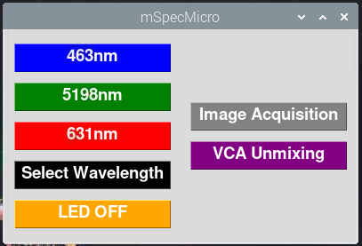

# Affordable Multispectral Microscope (MSM) Dataset

This repository contains the dataset and related scripts for the development of an affordable multispectral microscope (MSM).

## Overview

The MSM project aims to provide a cost-effective, real-time multispectral imaging system for tissue analysis in pathology and biomedical research. The dataset supports research and development for intelligent multispectral imaging using standard brightfield microscopes, machine vision cameras, and single-board computers.

## Features

- Multispectral image data for tissue classification and analysis
- Ready-to-use Jupyter Notebooks for data exploration and modeling
- Python scripts for preprocessing, analysis, and visualization
- Instructions for setting up the MSM hardware and software environment

## Requirements
- https://www.adafruit.com/product/3449?srsltid=AfmBOopNEwkcLEtwoHod-NYRx_wcHlTKsFRxJDIoc3XFVqxqCF--k1Ft
- https://github.com/koendv/openmv-ide-raspberrypi 
- Jupyter Notebook
- Raspberry Pi for hardware integration
- All requirement packages are provided in the initial of the all script

# Hardware setting
- Connect the MV camera with the SBC via USB
- Connect the LED matrix with SBC via SPI communication

Raspberry Pi Pin 2 (5V) ➝ DotStar VIN

Raspberry Pi Pin 6 (GND) ➝ DotStar GND

Raspberry Pi Pin 19 (MOSI / GPIO 10) ➝ DotStar DI

Raspberry Pi Pin 23 (SCLK / GPIO 11) ➝ DotStar CI

# Image Acquisition and spectral unmixing

- Triger the LED matrix from SBC
- R, G, and B threshold values

 for 631 nm, they are (130-255, 0-70, 0-50); 
 
 for 519 nm, (0-70, 130-255, 0-155);
 
 for 463 nm, (0-50, 40-170, 160-255);
 
 for bright field, (0-255, 0-255, 0-255)
  
- Upload the custum code on MV camera on chip for recognising the illumination threshold value
- The GUI script   run the camera IDE in backend and capture and pre-process the images and then tranfer to the SBC
- save the vca-python.py script in the same folder where the smages are saved on SBC
- click on the VCA unmixing button on GUI for spectral unmixing
- 
# ML Models for tissue classification
The tissue classification models in this repo use SVMs, RF amd XGboost trained on multispectral imaging data to improve tissue identification accuracy.
This approach is especially useful in pathology for identifying tumors and other conditions. Performance is measured using metrics like accuracy. In the context provided, SVMs trained on multispectral data achieved an accuracy of 0.94, outperforming models trained only on brightfield images.

